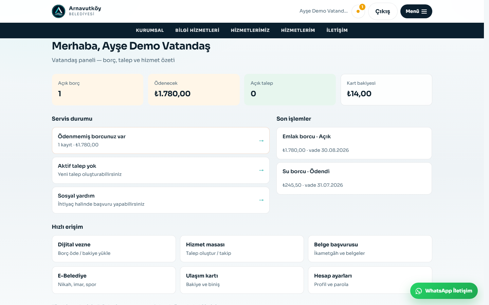
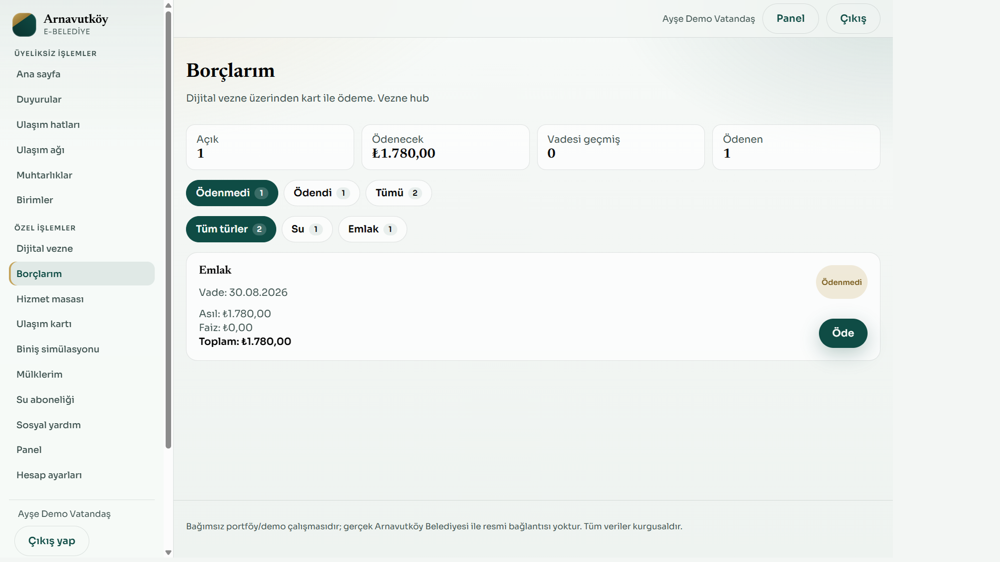
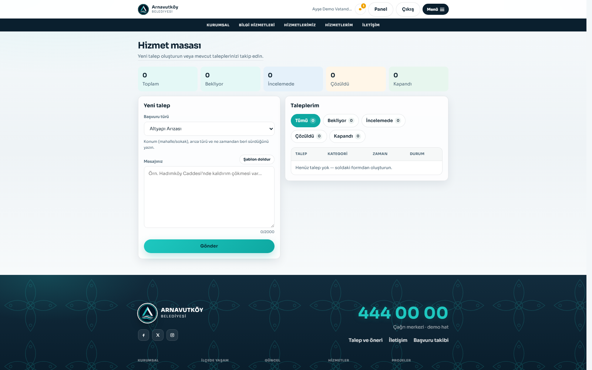
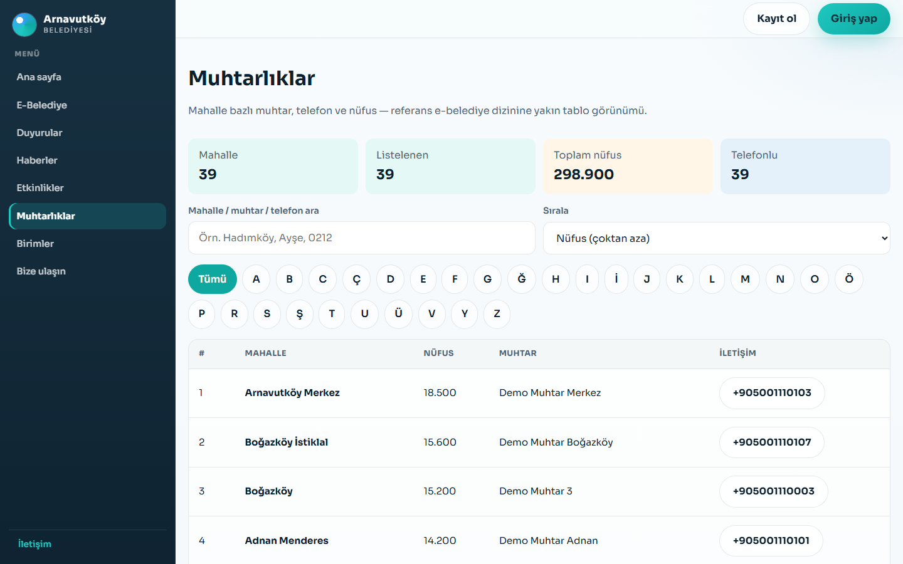
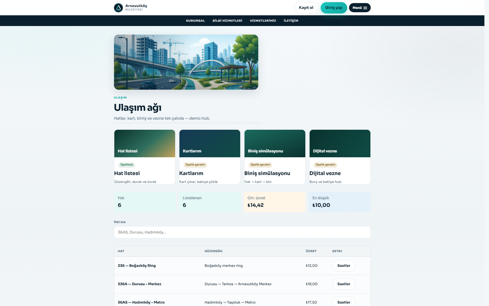

# Arnavutköy Belediyesi Örnek Dijital Hizmetler Platformu

> ⚠️ **Bu proje bağımsız bir portföy/demo çalışmasıdır; herhangi bir resmi belediye kurumunu temsil etmez ve onunla bağlantılı değildir.**
> Tüm vatandaş/personel/işlem verileri kurgusaldır. Kamuya açık coğrafi adlar (ör. mahalle isimleri) dışında gerçek kişisel veri kullanılmamıştır.

<p align="center">
  
</p>

<p align="center">
  <sub>Modern teal/navy belediye portalı — tam ekran hero, cam efektli hızlı erişim ve e-Belediye girişi</sub>
</p>

## Neden bu proje?

Modern bir belediye dijital hizmet platformunun **sıfırdan** tasarlanmış portföy uygulaması.
**.NET 8 + PostgreSQL** üzerinde Clean Architecture + CQRS ile vatandaş ve personel akışlarını
tek üründe birleştirir: güvenli kimlik, borç / vezne, hizmet masası, ulaşım, coğrafya ve operasyon panelleri.
Odak; okunabilir mimari, test edilebilir API ve gerçekçi bir demo deneyimi.

UI tarafında hero odaklı modern kurumsal dil kullanılır: lacivert / turkuaz palet, glassmorphism kartlar,
tam ekran manzara hero ve tutarlı e-Belediye deneyimi.

## Ekran görüntüleri


| Vatandaş paneli | Borçlarım |
| :---: | :---: |
|  |  |

| Hizmet masası | Muhtarlıklar |
| :---: | :---: |
|  |  |

<p align="center">
  
  <br />
  <sub>Ulaşım ağı — hatlar, kart, biniş ve vezne tek hub’da</sub>
</p>

## Öne çıkanlar

- **Vatandaş portalı** — duyuru, haber, etkinlik, kültür, faaliyet, hizmet rehberi, dijital vezne, borç, hizmet masası, ulaşım, mülk, su, sosyal yardım
- **E-Belediye** — belge başvurusu / takip, nikah randevu, imar durumu & harç hesabı, spor tesisi randevu, iletişim
- **Modern portal UI** — tam ekran hero, glassmorphism hızlı erişim, teal/navy kurumsal kabuk
- **Personel / yönetici** — talep masası, duyuru yönetimi, coğrafya, hat ve İK yönetimi
- **Kimlik** — e-posta + şifre, JWT access + refresh rotation, rol bazlı yetki
- **Mimari** — Clean Architecture, CQRS (MediatR), FluentValidation, EF Core + PostgreSQL
- **Ops** — Docker Compose, health check, Swagger, GitHub Actions, entegrasyon testleri

## Teknoloji

| Alan | Seçim |
|---|---|
| Runtime | .NET 8 (LTS) |
| API | ASP.NET Core Web API + Swagger |
| Veri | EF Core 8 + PostgreSQL 16 |
| Mimari | Clean Architecture + CQRS (MediatR) |
| Validasyon | FluentValidation |
| Kimlik | ASP.NET Core Identity + JWT (access + refresh rotation) |
| Loglama | Serilog (konsol + opsiyonel Seq) |
| UI | Vite + React + TypeScript |
| Test | xUnit, FluentAssertions, NSubstitute, Testcontainers, Coverlet |
| Ops | Docker Compose, GitHub Actions |

## Hızlı başlangıç

```bash
cd docker
cp .env.example .env
docker compose up --build -d
```

| | |
|---|---|
| Swagger | http://localhost:8080/swagger |
| Health | http://localhost:8080/health |
| Vatandaş UI | `cd web && npm install && npm run dev` → http://localhost:5173 |

### Demo hesaplar

| Rol | E-posta | Şifre |
|---|---|---|
| Vatandaş | `vatandas@demo.arnavutkoy.local` | `Demo!Citizen123` |
| Görevli | `gorevli@demo.arnavutkoy.local` | `Demo!Officer123` |
| Yönetici | `yonetici@demo.arnavutkoy.local` | `Demo!Admin123` |

Ortam değişkenleri → [`docs/DEPLOYMENT.md`](docs/DEPLOYMENT.md).
Portföy demo turu → [`docs/DEMO_WALKTHROUGH.md`](docs/DEMO_WALKTHROUGH.md).
Vatandaş arayüzü → [`web/README.md`](web/README.md).

```bash
dotnet test ArnavutkoyBelediyesi.slnx   # Docker Desktop gerekir (Testcontainers)
```

## Dokümantasyon

| Belge | İçerik |
|---|---|
| [`docs/DEMO_WALKTHROUGH.md`](docs/DEMO_WALKTHROUGH.md) | Portföy demo senaryosu (vatandaş / görevli / yönetici) |
| [`docs/PRD.md`](docs/PRD.md) | Ürün kapsamı ve modül envanteri |
| [`docs/ARCHITECTURE.md`](docs/ARCHITECTURE.md) | Katmanlar, CQRS, mimari kararlar |
| [`docs/SECURITY.md`](docs/SECURITY.md) | Tehdit modeli ve kontroller |
| [`docs/TESTING.md`](docs/TESTING.md) | Test stratejisi |
| [`docs/API.md`](docs/API.md) | v1 uç nokta haritası |
| [`docs/DEPLOYMENT.md`](docs/DEPLOYMENT.md) | Docker / sırlar / demo hesaplar |
| [`docs/ASSUMPTIONS.md`](docs/ASSUMPTIONS.md) | Mühendislik varsayımları |
| [`docs/DEFINITION_OF_DONE.md`](docs/DEFINITION_OF_DONE.md) | Faz 10 doğrulama kaydı |
| [`docs/CONTRIBUTING.md`](docs/CONTRIBUTING.md) | Katkı kuralları |

## Proje durumu

- [x] Faz 0–8 — Keşif → domain → application → persistence → API → güvenlik → test → Docker/CI
- [x] Faz 9 — Kapsamlı dokümantasyon
- [x] Faz 10 — Son kontrol (Definition of Done)
- [x] Yol haritası R1–R6 + vatandaş web paneli
- [x] Personel operasyon UI + demo walkthrough
- [x] E-posta giriş + yoğunlaştırılmış vatandaş UX + README vitrin
- [x] Hero odaklı modern belediye portal UI (teal/navy + glassmorphism)

DoD doğrulama kaydı: [`docs/DEFINITION_OF_DONE.md`](docs/DEFINITION_OF_DONE.md).

## Çözüm yapısı (özet)

```
src/Domain | Application | Persistence | Infrastructure | Api
tests/*.(Domain|Application|Infrastructure|Api.Integration)Tests
web/      docker/   docs/   .github/workflows/
```

Ayrıntı: [`docs/ARCHITECTURE.md`](docs/ARCHITECTURE.md).

## Lisans

[MIT](LICENSE) — Copyright (c) 2026 ibrahimyagar.
