# Arnavutköy Dijital Hizmetler

Modern bir belediye dijital hizmet platformunun **sıfırdan** tasarlanmış portföy uygulaması. Vatandaş portalı, e-belediye işlemleri, ulaşım rehberi ve personel operasyonlarını tek üründe birleştirir.

> **Bağımsız portföy / demo çalışmasıdır.** Resmi bir belediye kurumunu temsil etmez. Tüm vatandaş, personel ve işlem verileri kurgusaldır.

<p align="center">
  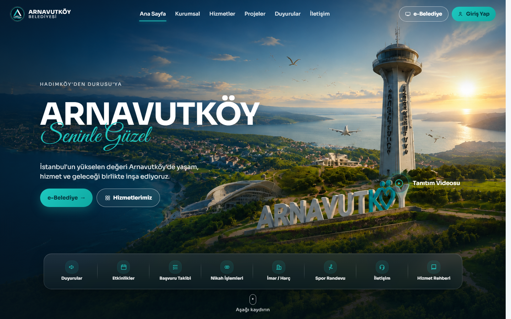
</p>

<p align="center">
  <a href="https://arnavutkoy-dijital.pages.dev"></a>
  
  
  
  
  
</p>

## Canlı demo

| | |
|---|---|
| **Vatandaş UI** | [https://arnavutkoy-dijital.pages.dev](https://arnavutkoy-dijital.pages.dev) |
| **API Health** | [https://arnavutkoy-digital-services-platform.onrender.com/health](https://arnavutkoy-digital-services-platform.onrender.com/health) |
| **API Swagger** | [https://arnavutkoy-digital-services-platform.onrender.com/swagger](https://arnavutkoy-digital-services-platform.onrender.com/swagger) |

> Render free tier’da API ~15 dk hareketsizlikten sonra uykuya geçebilir; ilk istek 30–60 sn sürebilir.

### Demo hesaplar (seed)

| Rol | E-posta | Şifre |
|---|---|---|
| Vatandaş | `vatandas@demo.arnavutkoy.local` | `Demo!Citizen123` |
| Görevli | `gorevli@demo.arnavutkoy.local` | `Demo!Officer123` |
| Yönetici | `yonetici@demo.arnavutkoy.local` | `Demo!Admin123` |

---

## Proje amacı

Kamu kurumuna yakışan, güvenilir ve modern bir dijital belediye deneyimini mühendislik disipliniyle göstermek:

- Clean Architecture + CQRS ile okunabilir / test edilebilir API
- JWT kimlik + rol bazlı yetki
- Gerçekçi vatandaş ve personel akışları (seed demo verisi)
- Docker ile tekrarlanabilir ortam
- React SPA ile tutarlı kurumsal UI

---

## Ekran görüntüleri

### Ana sayfa

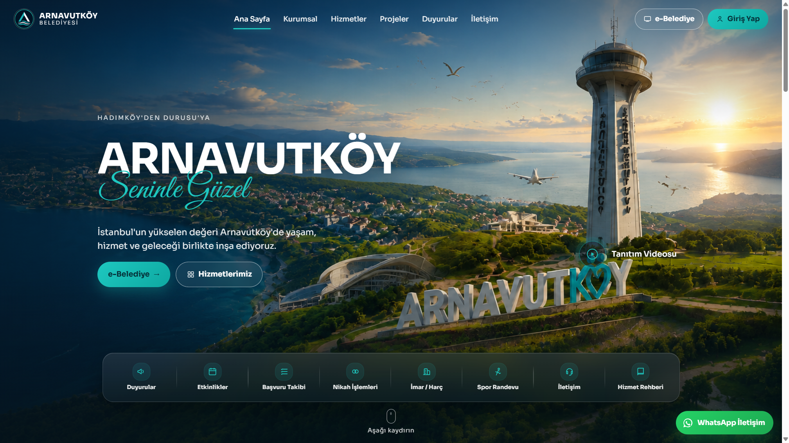

### Giriş

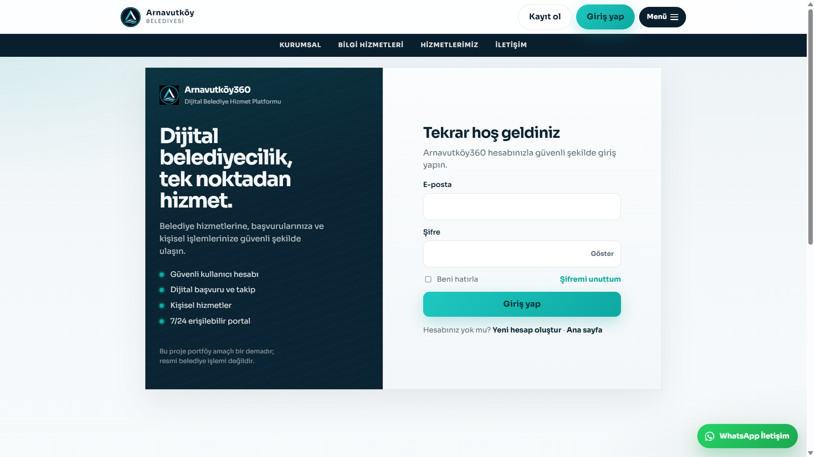

### E-Belediye

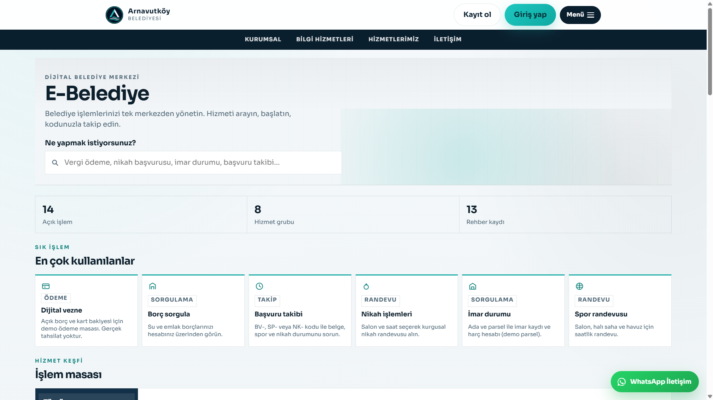

### Hizmet rehberi

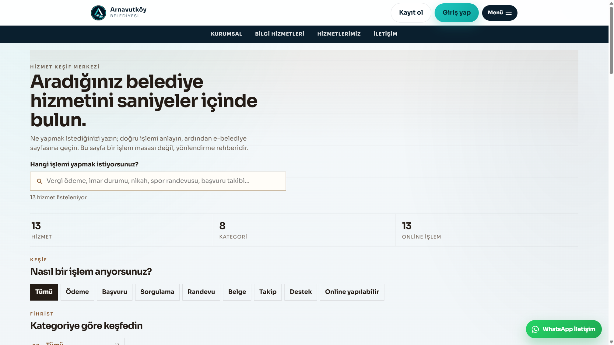

### Ulaşım ağı

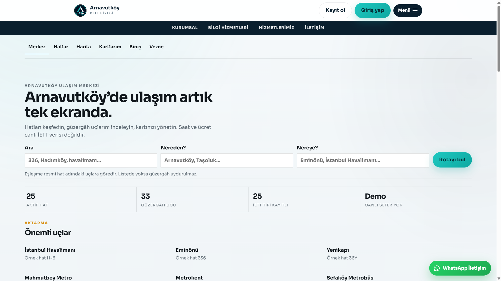

### Hatlar

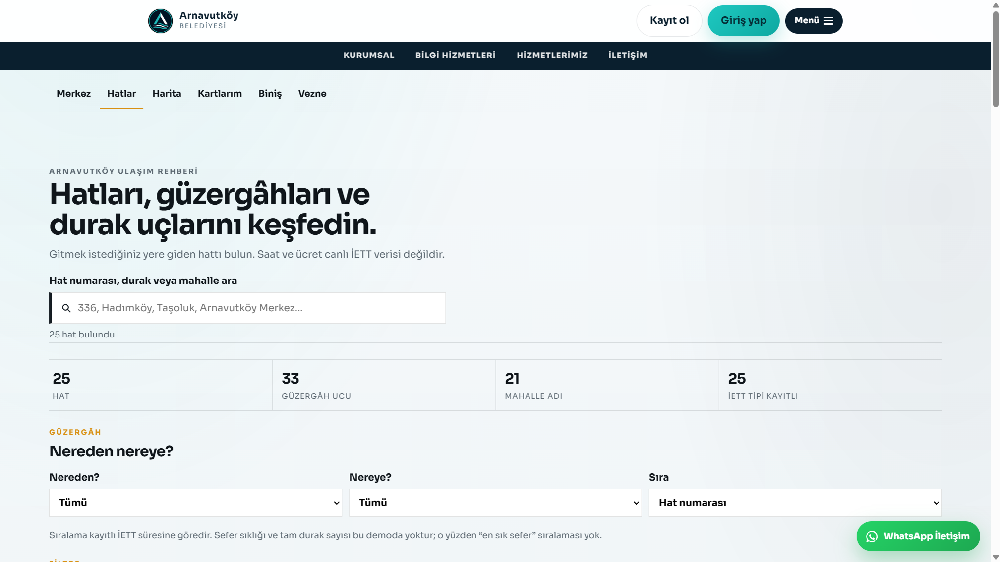

### Haberler

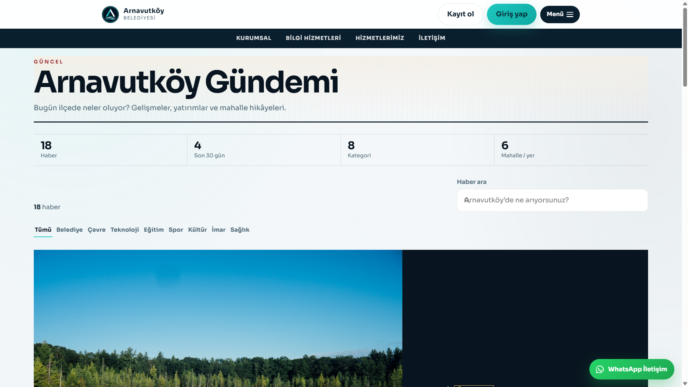

### Duyurular

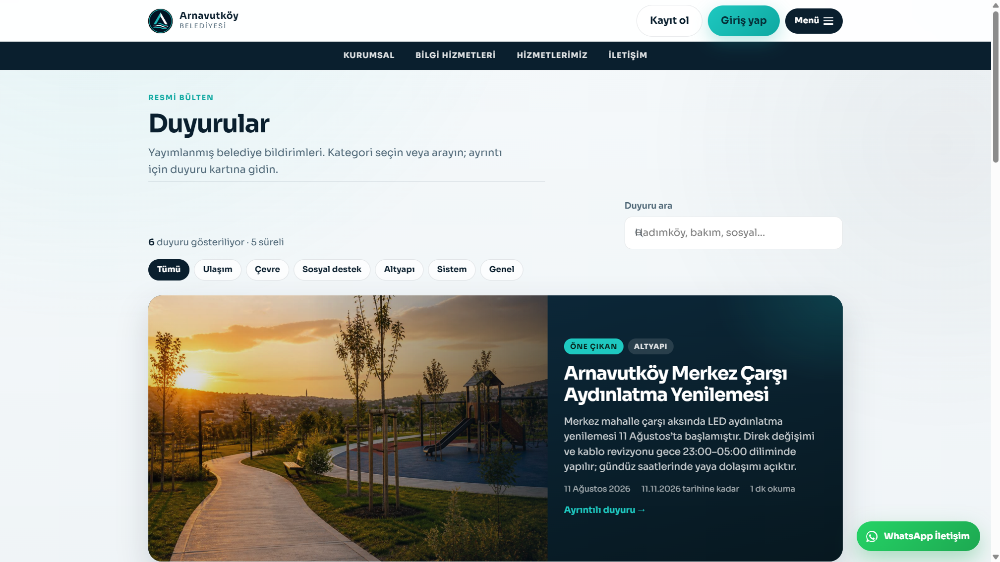

### Vatandaş paneli

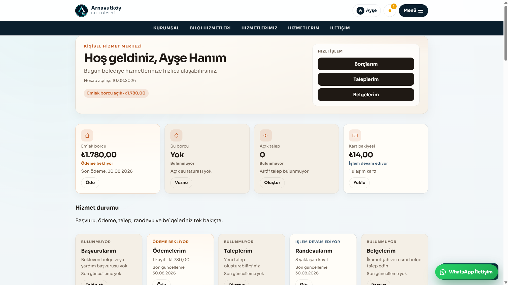

### Borçlarım

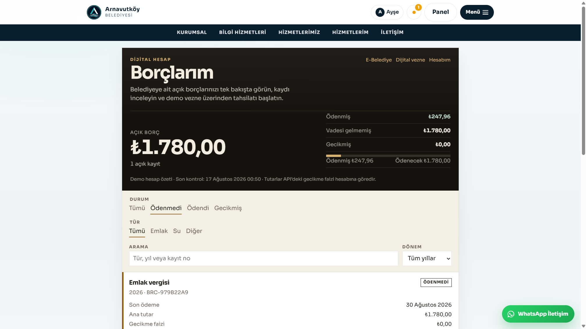

### İletişim

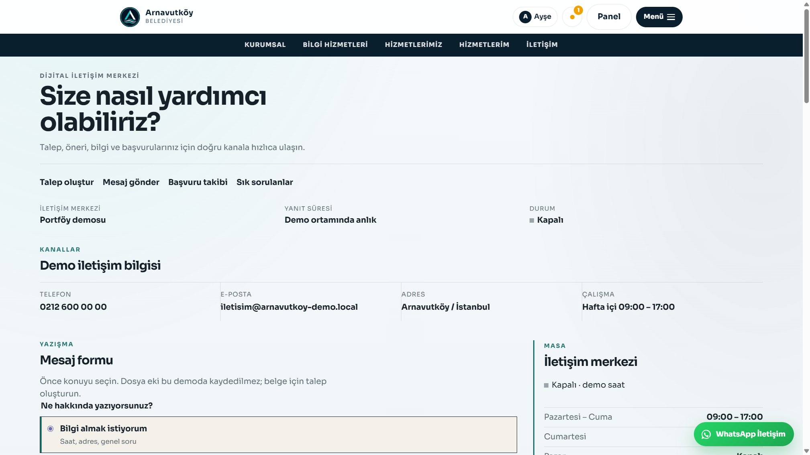

---

## Özellikler

### Dijital belediye hizmetleri

- E-Belediye işlem merkezi (arama, kategori, takip kodu)
- Dijital vezne (demo ödeme masası)
- Borç sorgulama / ödeme akışı (emlak, su)
- Belge başvurusu ve başvuru takibi (`BV-` / `SP-` / `NK-`)
- Nikah randevusu, imar durumu & harç hesabı, spor tesisi randevusu
- Hizmet rehberi (keşif / yönlendirme)
- Sosyal yardım ve talep / öneri kayıtları
- İletişim merkezi (niyet seçimi, form, SSS, demo konum)

### Ulaşım

- Ulaşım ağı merkezi (rota arama, harita, önemli uçlar)
- Otobüs hat kataloğu (filtre, mahalle, güzergâh uçları)
- Hat detay sayfaları
- Ulaşım kartı (bakiye / hareket — giriş gerekir)
- Biniş simülasyonu (demo tarife)
- Leaflet harita katmanı

### İlçe bilgi sistemi

- Haberler, duyurular, etkinlikler, faaliyetler
- Kültür & sanat mekânları
- Muhtarlıklar dizini
- Birimler (İK dizini)
- Kurumsal sayfa ve başkan mesajı

### Hesap ve operasyon

- Kayıt / giriş / şifremi unuttum (demo)
- Vatandaş paneli (borç, talep, kart, randevu özeti)
- Personel: hizmet masası, duyuru yönetimi, hat / birim / coğrafya yönetimi
- Rol bazlı yetki (Citizen / Officer / Administrator)

---

## Teknoloji yığını

| Alan | Seçim |
|---|---|
| Backend | ASP.NET Core 8 Web API |
| Mimari | Clean Architecture + CQRS (MediatR) |
| Veri | Entity Framework Core 8 + PostgreSQL |
| Kimlik | ASP.NET Core Identity + JWT (access + refresh rotation) |
| Validasyon | FluentValidation |
| Log | Serilog (konsol + opsiyonel Seq) |
| Frontend | Vite 7 + React 19 + TypeScript |
| Routing | React Router 7 |
| Harita | Leaflet |
| Stil | Sayfa bazlı özel CSS (Tailwind yok) |
| Test | xUnit, FluentAssertions, NSubstitute, Testcontainers |
| Ops | Docker Compose, GitHub Actions CI, Swagger, health checks |

---

## Mimari

```text
src/
├── ArnavutkoyBelediyesi.Domain          # Entity, kurallar, domain event
├── ArnavutkoyBelediyesi.Application     # CQRS handlers, DTO, FluentValidation
├── ArnavutkoyBelediyesi.Persistence     # EF Core, Identity, migration, seed
├── ArnavutkoyBelediyesi.Infrastructure  # JWT, Identity adaptörü, CurrentUser
└── ArnavutkoyBelediyesi.Api             # Controllers, middleware, DI, health

tests/
├── *.Domain.Tests
├── *.Application.Tests
├── *.Infrastructure.Tests
└── *.Api.IntegrationTests

web/                                     # Vite React vatandaş / personel UI
docker/                                  # Dockerfile + compose
docs/                                    # Mimari, API, güvenlik, demo turu
.github/workflows/                       # CI
```

Bağımlılık yönü: **Api → Application → Domain**; Persistence / Infrastructure Application arayüzlerini uygular.

Ayrıntı: [`docs/ARCHITECTURE.md`](docs/ARCHITECTURE.md)

---

## Hızlı başlangıç

### Docker (API + PostgreSQL)

```bash
cd docker
cp .env.example .env
docker compose up --build -d
```

| Kaynak | Adres |
|---|---|
| Swagger | http://localhost:8080/swagger |
| Health | http://localhost:8080/health |

### Vatandaş UI

```bash
cd web
cp .env.example .env   # VITE_API_BASE_URL=http://localhost:8080
npm install
npm run dev
```

Tarayıcı: http://localhost:5173

### Testler

```bash
dotnet test ArnavutkoyBelediyesi.slnx
```

> Entegrasyon testleri için Docker Desktop gerekir (Testcontainers).

Ortam değişkenleri ve dağıtım notları → [`docs/DEPLOYMENT.md`](docs/DEPLOYMENT.md)

---

## Dokümantasyon

| Belge | İçerik |
|---|---|
| [`docs/DEMO_WALKTHROUGH.md`](docs/DEMO_WALKTHROUGH.md) | Portföy demo senaryosu |
| [`docs/PRD.md`](docs/PRD.md) | Ürün kapsamı |
| [`docs/ARCHITECTURE.md`](docs/ARCHITECTURE.md) | Katmanlar ve CQRS |
| [`docs/API.md`](docs/API.md) | v1 uç nokta haritası |
| [`docs/SECURITY.md`](docs/SECURITY.md) | Tehdit modeli |
| [`docs/TESTING.md`](docs/TESTING.md) | Test stratejisi |
| [`docs/DEPLOYMENT.md`](docs/DEPLOYMENT.md) | Docker / sırlar / env |
| [`web/README.md`](web/README.md) | Frontend notları |

---

## Lisans

[MIT](LICENSE) — Copyright (c) 2026 ibrahimyagar.
